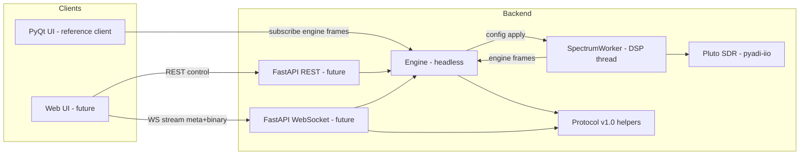

## Architecture block diagram

Notes:
* Engine publishes internal engine frames to clients.
* Protocol helpers serialize engine frames into wire frames for WS.
* Only spectrum/spectrogram display artifacts and metadata are streamed.
